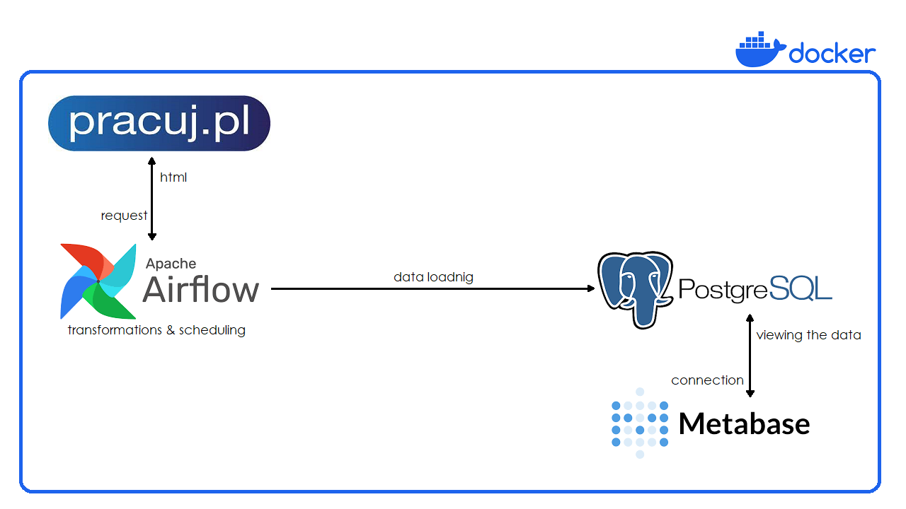
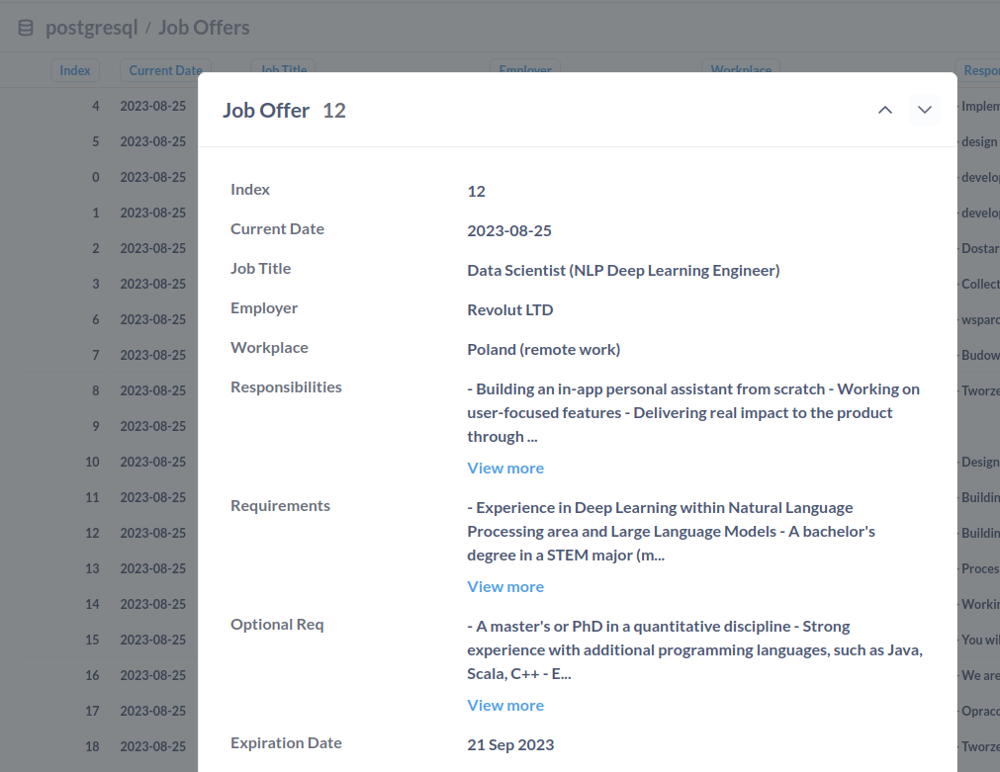

# pracuj.pl scraper

## About

This project intends to scrape data from pracuj.pl website in order to browse job offers faster - no need to click in each offer separately.
Fetched data is saved in PostgreSQL DB. Reading by Metabase. Workflow is managed in Airflow.
Our data source is nor replayable, but we can save data daily to ensure historical analysys.

## Development

### Requirements

+ [Docker](https://docs.docker.com/)
+ [Docker Compose](https://docs.docker.com/compose/#compose-documentation)

### Get started

+ Run `sudo mkdir -p logs dags && sudo chmod -R u=rwx,g=rwx,o=rwx logs dags` to create directories and add permissions 
+ Run `docker compose up airflow-init && docker compose up --build -d` to create images from docker-compose.yaml and to run database migrations and create the first user account in Airflow
+ Use `docker-compose down` to shutdown all services
+ Use `docker-compose up` to re-run all services whenever you want

## Result

